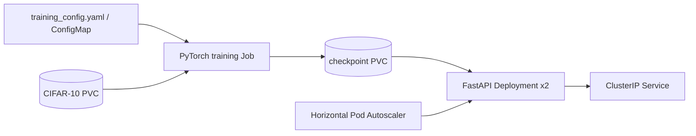

# MLOps PyTorch Pipeline

An end-to-end MLOps project that trains a CIFAR-10 image classifier and serves it through a FastAPI API. It runs locally with Docker or on Kubernetes.



## Repository layout

```
src/             Training, model, dataset, and serving code
configs/         Local training configuration
docker/          Training and serving Dockerfiles
k8s/             Kubernetes manifests
requirements/    Pinned dependency sets
tests/            Unit tests
```

## Local setup

Requires Python 3.11, Docker, and optionally a Kubernetes cluster with `kubectl`.

```bash
python -m venv .venv
# Windows: .venv\\Scripts\\activate
# macOS/Linux: source .venv/bin/activate
pip install -r requirements/train.txt
python -m src.train --config configs/training_config.yaml
```

The first run downloads CIFAR-10 into `data/` and writes the best checkpoint to `checkpoints/classifier_v1.pt`. Metrics are emitted as JSON lines for log aggregation.

## Docker

Build and train:

```bash
docker build -f docker/Dockerfile.train -t mlops-train:v1 .
docker run --rm -v "${PWD}/data:/app/data" -v "${PWD}/checkpoints:/app/checkpoints" mlops-train:v1
```

Build and serve a saved model:

```bash
docker build -f docker/Dockerfile.serve -t mlops-serve:v1 .
docker run --rm -p 8080:8080 -v "${PWD}/checkpoints:/app/checkpoints:ro" mlops-serve:v1
curl -X POST http://localhost:8080/predict -F "image=@test_image.png"
curl http://localhost:8080/health
```

On PowerShell, use `${PWD}` as shown; on bash/zsh, the same commands work. To point training at another configuration, set `TRAINING_CONFIG=/path/to/training_config.yaml` or pass `--config`.

## Kubernetes deployment

The included PVC manifest uses your cluster's default dynamic StorageClass. On a multi-node cluster, use an RWX-capable StorageClass for the checkpoint claim if serving replicas may land on different nodes. Build and make the images available to the cluster, then apply:

```bash
kubectl apply -f k8s/namespace.yaml
kubectl apply -f k8s/pvc.yaml
kubectl apply -f k8s/configmap.yaml
kubectl apply -f k8s/training-job.yaml
kubectl wait --for=condition=complete job/pytorch-training -n ml-training --timeout=30m
kubectl apply -f k8s/serving-deployment.yaml
kubectl apply -f k8s/serving-service.yaml
kubectl apply -f k8s/hpa.yaml
kubectl port-forward svc/model-serving 8080:80 -n ml-training
```

Then send a multipart request to `http://localhost:8080/predict` as above.

## Development workflow

Create `develop` from `main`; branch each change from `develop` (for example, `feature/docker-training` or `feature/k8s-deployment`), and merge via descriptive pull requests. Use Conventional Commit messages, such as `feat(training): add early stopping`. Do not commit checkpoints, downloaded data, or secrets.

Run unit tests with:

```bash
pytest
```
